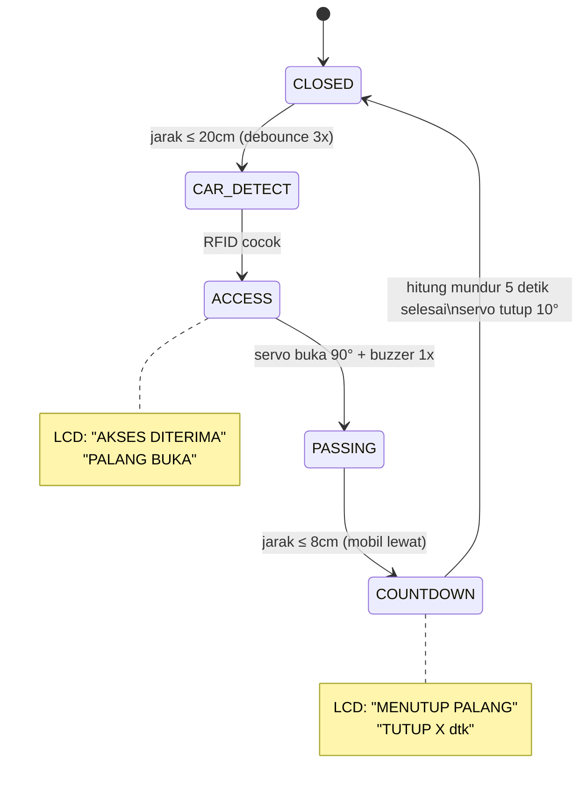

# Smart Parking — ESP32 + FreeRTOS

---

## Anggota:
- Iven RivaL Pangestu (H1H024013)   - [Github](https://github.com/Ivenrp)
- Apriyudha (H1H024010) - [Github](https://github.com/avriyyy)
- Mohammad Zulfan Ramadhan (H1H024008) - [Github](https://github.com/mzulfanr13-code) 
- Maharani Tri Wahyuningrum (H1H024012)
- Febrian Theopilus Purba	(H1H0240)


---

Sistem palang parkir otomatis berbasis ESP32 dengan FreeRTOS. Mendeteksi kendaraan menggunakan sensor ultrasonik HY-SR05, otentikasi via RFID MFRC522, dan kontrol palang menggunakan servo SG90.

## Flowchart



## Fitur

- **Deteksi kendaraan** — Ultrasonic HY-SR05 dengan median filter 5 sampel & debounce
- **Otentikasi RFID** — MFRC522, polling non-blocking di Core 1
- **Kontrol palang** — Servo SG90, buka 90° / tutup 10°
- **Indikator buzzer** — 1x beep (diterima), 3x beep cepat (ditolak)
- **LCD 16×2 I2C** — Menampilkan status sistem, akses, countdown
- **Sensor cahaya LDR** — Monitoring intensitas cahaya (LED onboard modul)
- **Countdown 5 detik** — Palang menutup 5 detik setelah mobil lewat (jarak < 8cm)
- **RTOS multitasking** — 3 task terpisah dengan prioritas & core pinning

## Komponen

| No. | Komponen | Jumlah | Fungsi |
|:---:|----------|:------:|--------|
| 1 | ESP32 Dev Module | 1 | Mikrokontroler utama |
| 2 | HY-SR05 (Ultrasonic) | 1 | Deteksi jarak kendaraan |
| 3 | MFRC522 (RFID Reader) | 1 | Membaca kartu RFID |
| 4 | Kartu RFID (13.56 MHz) | 1 | Media akses |
| 5 | SG90 Servo | 1 | Membuka/menutup palang |
| 6 | LCD 16×2 I2C (0x27) | 1 | Menampilkan informasi |
| 7 | Modul LDR (dengan DO) | 1 | Sensor cahaya |
| 8 | Passive Buzzer (3.3V) | 1 | Indikator suara |
| 9 | LED (dengan DO) | 1 | Lampu parkir menyala/mati |
| 10 | Breadboard + Kabel | - | Rangkaian |

## Wiring

### RFID MFRC522 (SPI)

| MFRC522 | ESP32 |
|---------|-------|
| SDA (SS) | GPIO5 |
| SCK | GPIO18 |
| MOSI | GPIO23 |
| MISO | GPIO19 |
| RST | GPIO27 |
| 3.3V | 3.3V |
| GND | GND |

### Ultrasonic HY-SR05

| HY-SR05 | ESP32 |
|---------|-------|
| VCC | 5V |
| GND | GND |
| TRIG | GPIO32 |
| ECHO | GPIO33 |

### Servo SG90

| SG90 | ESP32 |
|------|-------|
| Merah (VCC) | 5V |
| Coklat (GND) | GND |
| Oranye (Signal) | GPIO13 |

### Buzzer

| Buzzer | ESP32 |
|--------|-------|
| (+) | GPIO14 |
| (-) | GND |

### LDR (Modul DO/AO)

| LDR Module | ESP32 |
|------------|-------|
| VCC | 3.3V |
| GND | GND |
| DO | GPIO4 |
<!--| AO | GPIO34 (ADC opsional — uncomment di kode) |-->

### LCD I2C 16×2

| LCD | ESP32 |
|-----|-------|
| VCC | 5V |
| GND | GND |
| SDA | GPIO21 |
| SCL | GPIO22 |

## Arsitektur RTOS

ESP32 dual-core menjalankan 3 task FreeRTOS:

- **Core 0** — `taskUltrasonic` (priority 2, stack 4096) menangani pembacaan jarak ultrasonik, state machine gate, kontrol servo, serta LCD. ISR `isrEcho` juga terpasang di core ini. `taskLDR` (priority 1, stack 2048) membaca sensor LDR via polling.
- **Core 1** — `taskRFID` (priority 2, stack 4096) menangani scanning kartu RFID via SPI dan mengecek UID. Hasil dikirim ke taskUltrasonic lewat flag `rfidGranted`.

### Sinkronisasi

- **Binary Semaphore (`echoSem`)** — ISR memberi sinyal ke task setelah echo ultrasonik diterima, menggantikan polling loop yang boros CPU
- **Mutex (`lcdMutex`)** — Mencegah tabrakan akses LCD I2C antar task (`taskUltrasonic` dan `taskRFID`)

### Priority & Stack

| Task | Core | Priority | Stack | Fungsi |
|------|:----:|:--------:|:-----:|--------|
| `taskUltrasonic` | 0 | 2 | 4096 | Ultrasonic + state machine |
| `taskRFID` | 1 | 2 | 4096 | RFID scanning |
| `taskLDR` | 0 | 1 | 2048 | Monitoring LDR |

## Pin Mapping

| GPIO | Terhubung ke | Mode |
|:----:|-------------|:----:|
| 4 | LDR DO | INPUT |
| 5 | RFID SDA (SS) | OUTPUT |
| 13 | Servo Signal | OUTPUT (PWM) |
| 14 | Buzzer (+) | OUTPUT |
| 18 | RFID SCK | OUTPUT |
| 19 | RFID MISO | INPUT |
| 21 | LCD SDA (I2C) | I/O |
| 22 | LCD SCL (I2C) | I/O |
| 23 | RFID MOSI | OUTPUT |
| 27 | RFID RST | OUTPUT |
| 32 | Ultrasonic TRIG | OUTPUT |
| 33 | Ultrasonic ECHO | INPUT (ISR) |

## Skema Rangkaian (Wokwi)


> **Link simulasi Wokwi:** [Wokwi](https://wokwi.com/projects/466242692283076609)

## Cara Kerja

1. **Inisialisasi** — ESP32 boot, inisialisasi semua perangkat, buat 3 task FreeRTOS
2. **Menunggu mobil** — Task ultrasonic membaca jarak setiap ~600ms (median 5 sampel). Jika jarak ≤ 20cm stabil 3× berturut-turut, sistem mendeteksi mobil
3. **Scan RFID** — Task RFID aktif dan menunggu kartu. Jika UID cocok, akses diberikan
4. **Palang terbuka** — Servo ke posisi 90°, buzzer 1×, LCD menampilkan "AKSES DITERIMA"
5. **Mobil lewat** — Sistem menunggu jarak ≤ 8cm (mobil tepat di palang)
6. **Countdown** — Hitung mundur 5 detik, LCD menampilkan sisa waktu. Tidak bisa dibatalkan
7. **Palang tertutup** — Servo kembali ke 10°, LCD standby. Siap mendeteksi mobil berikutnya

## Output LCD 16×2

| Kondisi | Baris 1 | Baris 2 |
|---------|---------|---------|
| **Sistem standby** | `SELAMAT DATANG` | ` ` |
| **Mobil terdeteksi** | `ADA MOBIL` | `SCAN RFID` |
| **Akses diterima** | `AKSES DITERIMA` | `PALANG BUKA` |
| **Akses ditolak** | `AKSES DITOLAK` | `KARTU INVALID` |
| **Setelah ditolak** | `COBA LAGI` | `SCAN RFID` |
| **Countdown aktif** | `MENUTUP PALANG` | `TUTUP 5 dtk` |
| **Countdown berjalan** | `MENUTUP PALANG` | `TUTUP 4 dtk` (dst) |

## Library Dependencies

- `ESP32Servo` — Kontrol servo
- `marcoschwartz/LiquidCrystal_I2C` — LCD I2C
- `miguelbalboa/MFRC522` — RFID reader

## Serial Monitor Output

```
[Ultrasonik]   Jarak:  45 cm | Status: KOSONG
[RFID] Status: TIDAK AKTIF (tunggu deteksi mobil)
[LDR]  DO: HIGH | Cahaya: GELAP
----------------------------------------
[Ultrasonik]   Jarak:  15 cm | Status: ADA MOBIL <<<
[GATE] CLOSED → CAR_DETECT
[RFID] Status: AKTIF — menunggu scan kartu...
[RFID] Kartu terdeteksi — UID: 52 89 16 05
[RFID] >> AKSES DITERIMA
[GATE] CAR_DETECT → ACCESS — BUKA PALANG
[SERVO] Posisi: BUKA 90°
[GATE] PASSING → COUNTDOWN (5dtk)
[SERVO] Posisi: TUTUP 10°
[GATE] COUNTDOWN → CLOSED
```

## Lampiran

> [FOTO RANGKAIAN]
>
> [FOTO REAL]
>
> [DOKUMENTASI LAINNYA]
