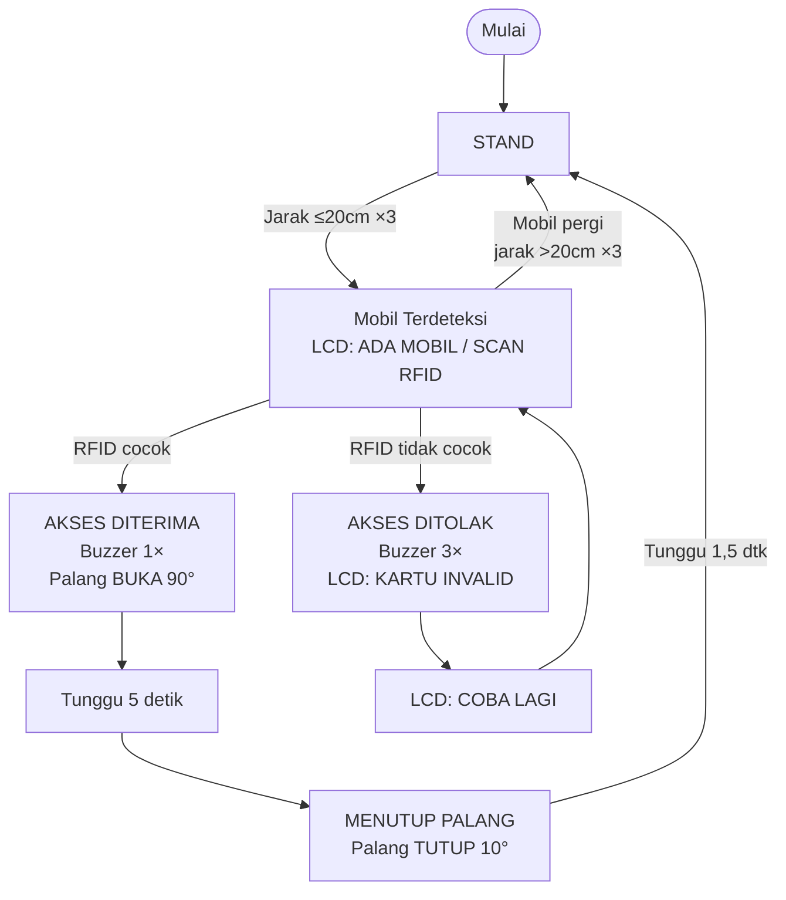
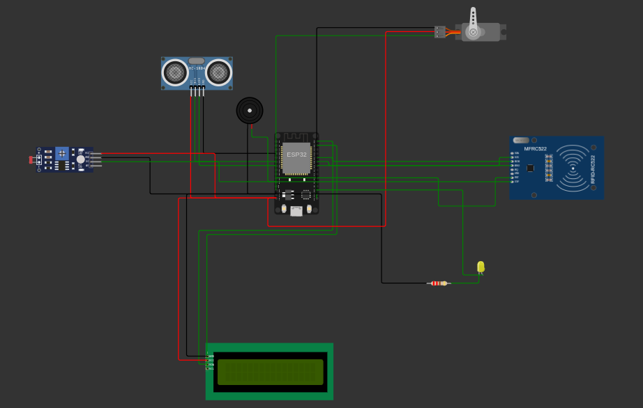

# Smart Parking — ESP32 + FreeRTOS

---

## Anggota:
- Iven RivaL Pangestu (H1H024013) - [Github](https://github.com/Ivenrp)
- Apriyudha (H1H024010) - [Github](https://github.com/avriyyy)
- Mohammad Zulfan Ramadhan (H1H024008) - [Github](https://github.com/mzulfanr13-code)
- Maharani Tri Wahyuningrum (H1H024012)
- Febrian Theopilus Purba (H1H0240)

---

Sistem palang parkir otomatis berbasis ESP32 dengan FreeRTOS. Mendeteksi kendaraan menggunakan sensor ultrasonik HY-SR05, otentikasi via RFID MFRC522, dan kontrol palang menggunakan servo SG90.

## Flowchart



## Fitur

- **Deteksi kendaraan** — Ultrasonic HY-SR05 dengan ISR CHANGE + median filter 5 sampel & debounce
- **Otentikasi RFID** — MFRC522, polling non-blocking di Core 1
- **Kontrol palang** — Servo SG90, buka 90° / tutup 10°
- **Indikator buzzer** — 1x beep (diterima), 3x beep cepat (ditolak)
- **LCD 16×2 I2C** — Menampilkan status sistem, akses diterima/ditolak
- **Sensor cahaya LDR** — ISR CHANGE, monitoring intensitas cahaya (LED onboard modul)
- **RTOS multitasking** — 3 task terpisah dengan prioritas & core pinning, 2 ISR

## Komponen

| No. | Komponen | Jumlah | Fungsi |
|:---:|----------|:------:|--------|
| 1 | ESP32 Dev Module | 1 | Mikrokontroler utama |
| 2 | HY-SR05 (Ultrasonic) | 1 | Deteksi jarak kendaraan |
| 3 | MFRC522 (RFID Reader) | 1 | Membaca kartu RFID |
| 4 | Kartu RFID (13.56 MHz) | 1 | Media akses |
| 5 | SG90 Servo | 1 | Membuka/menutup palang |
| 6 | LCD 16×2 I2C (0x27) | 1 | Menampilkan informasi |
| 7 | Modul LDR (dengan DO) | 1 | Sensor cahaya + LED indikator |
| 8 | Active Buzzer (3.3V) | 1 | Indikator suara |
| 9 | Breadboard + Kabel | - | Rangkaian |

## Wiring

### RFID MFRC522 (SPI)

| MFRC522 | ESP32 |
|---------|-------|
| SDA (SS) | GPIO5 |
| SCK | GPIO18 |
| MOSI | GPIO23 |
| MISO | GPIO19 |
| RST | GPIO27 |
| 3.3V | 3.3V |
| GND | GND |

### Ultrasonic HY-SR05

| HY-SR05 | ESP32 |
|---------|-------|
| VCC | 5V |
| GND | GND |
| TRIG | GPIO32 |
| ECHO | GPIO33 |

### Servo SG90

| SG90 | ESP32 |
|------|-------|
| Merah (VCC) | 5V |
| Coklat (GND) | GND |
| Oranye (Signal) | GPIO13 |

### Buzzer

| Buzzer | ESP32 |
|--------|-------|
| (+) | GPIO14 |
| (-) | GND |

### LDR (Modul DO)

| LDR Module | ESP32 |
|------------|-------|
| VCC | 3.3V |
| GND | GND |
| DO | GPIO4 |

### LCD I2C 16×2

| LCD | ESP32 |
|-----|-------|
| VCC | 5V |
| GND | GND |
| SDA | GPIO21 |
| SCL | GPIO22 |

## Arsitektur RTOS

ESP32 dual-core menjalankan 3 task FreeRTOS + 2 ISR:

- **Core 0** — `ultrasonicTask` (priority 2, stack 4096) menangani trigger ultrasonik & membaca hasil dari ISR `echoISR`, median filter, debounce, serta update LCD. `ldrTask` (priority 1, stack 2048) membaca state dari ISR `ldrISR` dan mencetak ke Serial Monitor.
- **Core 1** — `rfidTask` (priority 2, stack 4096) menangani scanning kartu RFID via SPI, verifikasi UID, kontrol servo & buzzer, serta update LCD.

### Sinkronisasi

- **ISR `echoISR`** — CHANGE pada ECHO_PIN. `echoStart` dicatat saat RISING, `echoDuration` saat FALLING, flag `echoReady` di-set. ultrasonicTask mereset flag via `portDISABLE_INTERRUPTS()` sebelum trigger untuk atomisitas.
- **ISR `ldrISR`** — CHANGE pada LDR_DO_PIN. Menyimpan state DO ke `ldrState` dan flag `ldrChanged`. ldrTask membaca flag setiap siklus.
- **Global flags** — `carDetected`, `gateBusy` diakses antar task tanpa mutex (akses bool/int atomic pada ESP32; delay alami serialisasi akses LCD).
- **LCD** — Diakses dari ultrasonicTask (status mobil/standby) dan rfidTask (akses diterima/ditolak). Tidak ada race condition karena rfidTask memegang kontrol penuh selama `gateBusy=true`.

### Priority & Stack

| Task | Core | Priority | Stack | Fungsi |
|------|:----:|:--------:|:-----:|--------|
| `ultrasonicTask` | 0 | 2 | 4096 | Ultrasonic + debounce + LCD |
| `rfidTask` | 1 | 2 | 4096 | RFID + servo + buzzer + LCD |
| `ldrTask` | 0 | 1 | 2048 | Monitoring LDR |

## Pin Mapping

| GPIO | Terhubung ke | Mode |
|:----:|-------------|:----:|
| 4 | LDR DO (ISR) | INPUT |
| 5 | RFID SDA (SS) | OUTPUT |
| 13 | Servo Signal | OUTPUT (PWM) |
| 14 | Buzzer (+) | OUTPUT |
| 18 | RFID SCK | OUTPUT |
| 19 | RFID MISO | INPUT |
| 21 | LCD SDA (I2C) | I/O |
| 22 | LCD SCL (I2C) | I/O |
| 23 | RFID MOSI | OUTPUT |
| 27 | RFID RST | OUTPUT |
| 32 | Ultrasonic TRIG | OUTPUT |
| 33 | Ultrasonic ECHO (ISR) | INPUT |

## Skema Rangkaian (Wokwi)



> **Link simulasi Wokwi:** [Wokwi](https://wokwi.com/projects/466242692283076609)

## Cara Kerja

1. **Inisialisasi** — ESP32 boot, init semua perangkat, pasang 2 ISR, buat 3 task FreeRTOS
2. **Menunggu mobil** — `ultrasonicTask` trigger HY-SR05, `echoISR` hitung durasi pulsa Setelah median filter 5 sampel + debounce 3×, jika jarak ≤20cm stabil, `carDetected = true`. LCD: "ADA MOBIL / SCAN RFID"
3. **Scan RFID** — `rfidTask` aktif (Core 1) polling kartu
4. **Jika UID cocok** — Buzzer 1×, servo buka 90°, LCD "AKSES DITERIMA / PALANG BUKA". Tunggu 5 detik, servo tutup 10°, LCD standby
5. **Jika UID tidak cocok** — Buzzer 3×, LCD "AKSES DITOLAK / KARTU INVALID". Tunggu 2 detik, LCD "COBA LAGI / SCAN RFID", bisa scan ulang
6. **LDR** — `ldrISR` deteksi perubahan cahaya, `ldrTask` cetak ke Serial Monitor

## Output LCD 16×2

| Kondisi | Baris 1 | Baris 2 |
|---------|---------|---------|
| **Sistem standby** | `SMART PARKING` | `SIAP...` |
| **Mobil terdeteksi** | `ADA MOBIL` | `SCAN RFID` |
| **Akses diterima** | `AKSES DITERIMA` | `PALANG BUKA` |
| **Akses ditolak** | `AKSES DITOLAK` | `KARTU INVALID` |
| **Setelah ditolak** | `COBA LAGI` | `SCAN RFID` |
| **Menutup palang** | `MENUTUP PALANG` | `HARAP TUNGGU` |

## Library Dependencies

- `ESP32Servo` — Kontrol servo
- `marcoschwartz/LiquidCrystal_I2C` — LCD I2C
- `miguelbalboa/MFRC522` — RFID reader

## Serial Monitor Output

```
============================================
       SMART PARKING — ESP32 FreeRTOS
============================================
  [Ultrasonik]   = Ultrasonic HY-SR05
  [RFID] = MFRC522
  [LDR]  = Sensor Cahaya DO (LED onboard)
  [SERVO]= Palang Parkir
--------------------------------------------
[SERVO] Init TUTUP 10°
[ISR]  ECHO terpasang (GPIO 33)
[ISR]  LDR DO terpasang (GPIO 4)
[RTOS] Task Ultrasonic -> Core 0, prioritas 2
[RTOS] Task RFID       -> Core 1, prioritas 2
[RTOS] Task LDR        -> Core 0, prioritas 1
--------------------------------------------
  Sistem berjalan. Monitor di bawah ini:
============================================

[LDR]  Init — DO: HIGH | Cahaya: GELAP
[RFID] Status: TIDAK AKTIF (tunggu deteksi mobil)
[Ultrasonik]   Jarak:  45 cm | Status: KOSONG
[RFID] Status: TIDAK AKTIF (tunggu deteksi mobil)
[LDR]  DO: HIGH | Cahaya: GELAP  | LED: NYALA
[RFID] Status: TIDAK AKTIF (tunggu deteksi mobil)
[Ultrasonik]   Jarak:  17 cm | Status: ADA MOBIL <<<
[RFID] Status: AKTIF — menunggu scan kartu...
[RFID] Kartu terdeteksi — UID: 52 89 16 05
[RFID] >> AKSES DITERIMA — palang BUKA 90°
[SERVO] Posisi: BUKA 90°
[RFID] Status: GATE SIBUK (palang bergerak)
...
[SERVO] Menutup palang...
[SERVO] Posisi: TUTUP 10°
[RFID] Siklus selesai — sistem kembali standby
```
